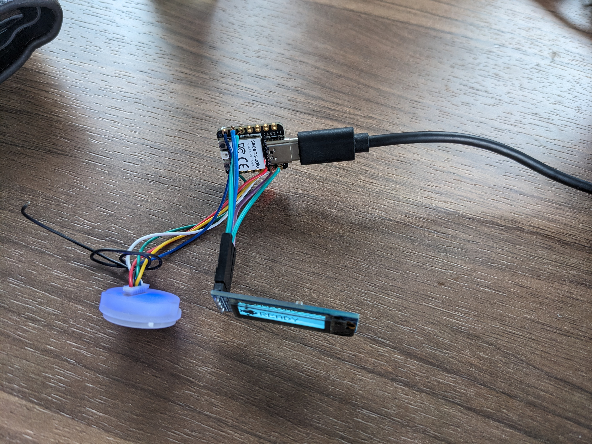

## **Communicate to Trinket M0 via Dart**

### Description

The project involves communicating with a Microcontroller Board using Dart. The board uses CircuitPython and controls a R557 fingerprint sensor. The end goal of the project is for a PC to interact with the fingerprint sensor, downloading and uploading template from and to it. The choice of using Dart is to enable Android and IOS app development allowing mobile devices to communicate with the fingerprint sensor too.

The project is done in **Linux** (Mint) due to libserialport library being easily downloadable. Hence, the how to run section **does not apply to Window or MacOS**.

### Hardware Requirement

**Current implementation:**

* Seeed Studio XIAO RP2040
* 0.91 inch OLED that is compatible with SSD1306 (adadfruit) driver
* USB C to USB A cable
* Laptop or PC with USB A port
* Female header wire for display
* Soldering kit

<figure>
    
    <figcaption>Microcontroller Board fully connected. More detail in <a href="https://superstupidness.github.io/trinket_m0_communicate/pythondoc/">Documentation</a></figcaption>
    

    

</figure>

Tested Board:

* Trinket M0 (Not suitable due to not enough RAM)
* Raspberry Pi Pico (I2C pull up resistor needed if display is used)

*Note: We found that boards with RP2040 chip work great with our CircuitPython code due to their large RAM. In terms of display and I2C, make sure the board has built in pull up resistor.*

### How to Run

1. Download Dart SDK
2. Download the project files in [Github](https://github.com/SuperStupidness/trinket_m0_communicate/tree/main)
3. Navigate to the folder and download dependencies of dart code

            dart pub upgrade

4.  Download libserialport (C) library using

            sudo apt install libserialport-dev

5.  Copy code.py and lib folder into Trinket M0/Raspberry Pi Pico

      * If there is a SSD1306 display connected, copy the img folder onto the board.

6.  Run the dart code

            dart communicate_trinket_m0.dart

7.  (Optional) If the Dart code shows that the board is in REPL when first booted up, use command 'reset' by typing it in the terminal to restart the python code.

*Note: During our app developement, we found that usb_serial (flutter) library works great as we don't need to download libserialport library. Consider usb_serial as an alternative to libserialport.*

### Updates

Updates 31/1/2024:
- Add display support using adafruit_displayio_ssd1306 library
- Change commands to output message to display
- Add display functions in custom_fingerprint_lib to show text and logo (text, mutiple text, scroll text)
- Add bitmap images to display: company logo, checkmark, crossmark, triple dot
- Add exception handling and more checks for upload template
- Add exception handling if there is no display
- Small fix in enroll to check if there is a display.
- Fix sensor init function. Now, it will probably set sensor's baudrate correctly
- Add more error codes for upload
- Doc:
      - Add Seeed Studio RP2040 board to doc
      - Add generating bitmap guide
      - Add display guide
      - Document sensor init function does not scan and reconnect if data package size is changed (manual intervention require)
      - Document display function
      - Add video examples

Updates 18/1/2024:
- Download and Upload template is now functional. Template is stored in templateBuffer variable in Dart which can be written to a file or save in a database.
- Implement interrupt finger request by Esc then Enter
- Implement clear template library function by entering 6
- Added docs folder for Github Page which can be found [here](https://superstupidness.github.io/trinket_m0_communicate/)
- **Enroll and Delete commands now require two numbers seperated by a space, >Command Location. No more Command -> Location.**
- Fix sending Error 2 while waiting for finger

Update 15/1/2024:
- Implement download and upload + verify template on board but **only** when the template is saved locally on board. Dart template retrieval does not work yet.
- Add reset command (Sending Ctrl+D via USB) when board is stuck in REPL. Still very janky. Only works when Dart connects straight into REPL.
- Attempted to implement Download template on dart but template is misssing data/gets wrong data
- TODO: Download and upload template in dart. Solve SerialPortError on Dart when downloading and uploading templates.

Update 9/1/2024:
- Added script to compile python library to board. It also save code.py to board.
- download\_template() is now enroll\_and\_send\_to_usb() (still unfished but _Soooooon_)
- Added userGetInput function to check for valid user input in Dart
- Added printAvailableCommands() to display commands menu
- **Output/print from board is now in the form of all caps short strings (ex: OKIMAGE). If extra output is required, it will be spaced out (ex: OKSEARCH 2 100 -> Finger found at #2, confidence 100). Error codes are in the form: ERROR _\<code\_number\>_. The code number can be found in adafruit fingerprint library (circuitpython or cpp) for debug**
- TODO: Exception handler when failing to connect to fingerprint and when failing to read template

Update 8/1/2024:
- Included lib folder with .mpy file to reduce memory usage (memory error still occurs with download_model)
- Updated README from txt to md
- Added project title, description and how to run in README.md
- Removed trinket_code_v1.py and trinket_code_v2.py. Replace with code.py
- Included library normal .py code before compiling to .mpy
- Added cross compilation tool mpy-cross (require execution permission)

Update 7/1/2024:
- Updated dart code to latest version
- Added python code in trinket m0 (circuitpython)
    + v1: full functionality: enroll, find, delete, set led
          load, get model available but causes MemoryError
    + v2 (latest): remove set led, import specific function only, added gc for
          memory checking, converted load, get model to download model function
          Still not functional due to MemoryError on get_fpdata()

### Documentation

Github Page [here](https://superstupidness.github.io/trinket_m0_communicate/)

### Reference and Resources
Flutter version of libserialport (Dart) is available [here](https://pub.dev/packages/flutter_libserialport)

libserialport download solution found [here](https://stackoverflow.com/questions/73387868/libserial-is-not-detected-in-my-dart-programm)

Adafruit Fingerprint library (Circuitpython) [here](https://github.com/adafruit/Adafruit_CircuitPython_Fingerprint/blob/main/adafruit_fingerprint.py)

Adafruit Fingerprint code (Circuitpython) [here](https://learn.adafruit.com/adafruit-optical-fingerprint-sensor/circuitpython)

.py to .mpy compilation tool [here](https://learn.adafruit.com/welcome-to-circuitpython/frequently-asked-questions)

