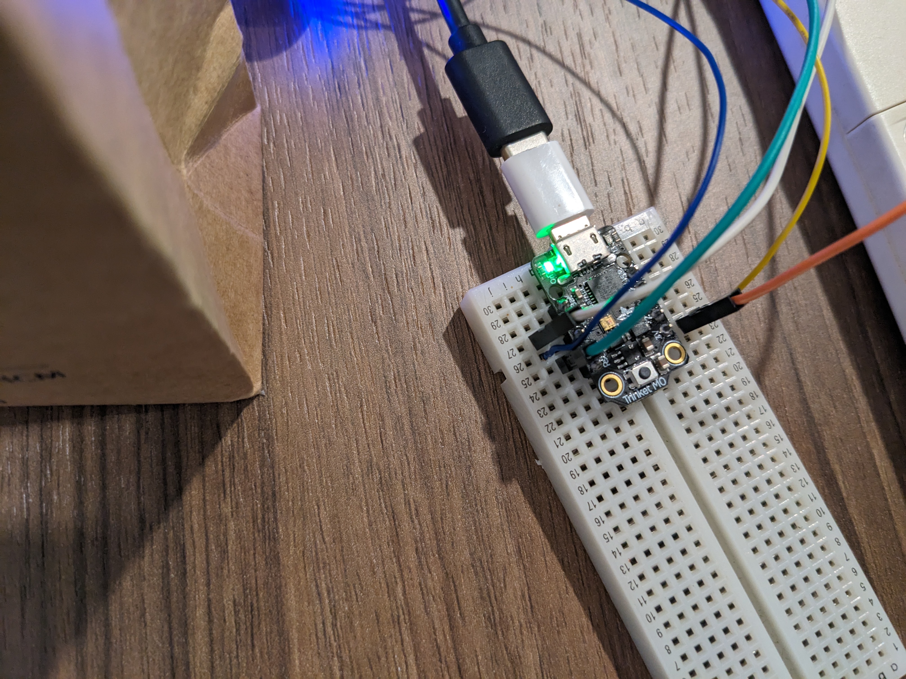
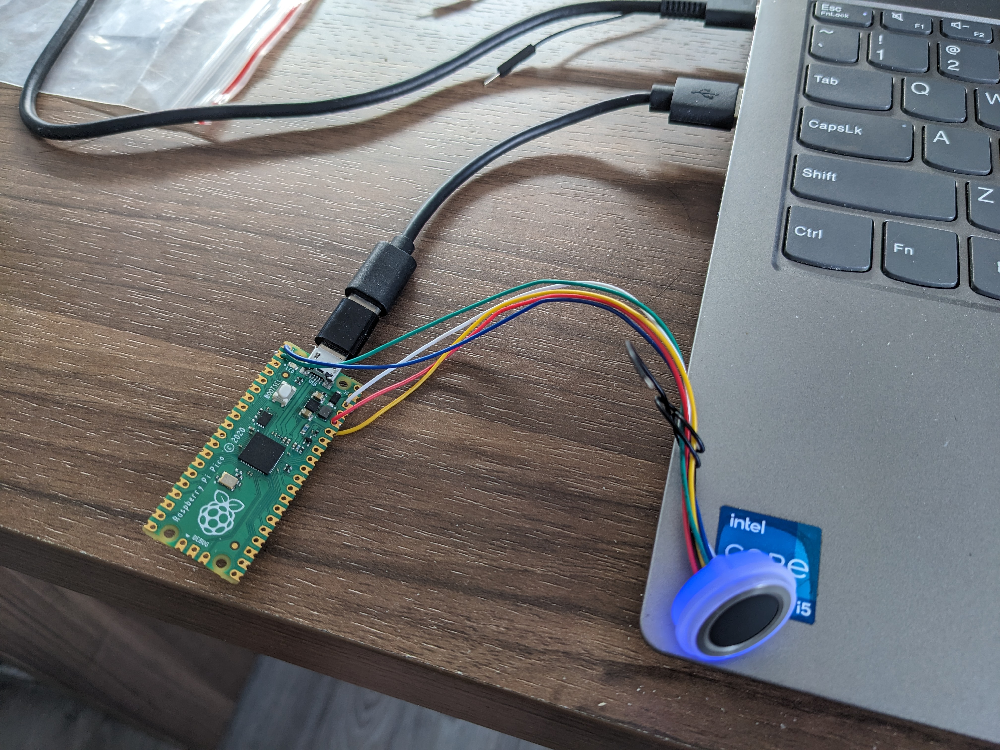

# Introduction

## About the Project
This project involves communicating from a computer to a Adafruit Trinket M0 board using Dart. The board is connected to our computer using the Micro USB port.

Our goal is to talk to a R553 fingerprint sensor through the Trinket M0 board. Luckily, the sensor based its protocol on the Adafruit Fingerprint library, and we can use the library to communicate with it. Our Dart and Python code are developed to use most of the functions in the library and more importantly, send and receive fingerprint templates back to the computer.

The project is a framework or proof of concept for a Biometric Verification System with templates store in a database that can be use to verify users/customers/clients/etc. The Dart language also enables the developement of a mobile app on Android or IOS to use this system.

This project is done on Linux with Window or MacOS being technically possible but requires more work compiling libserialport library to their platform. We have no guarantee that it will work in Window or MacOS as it has not been tested by us.

**Update: Midway through the project, we discovered that the Trinket M0 is unable to receive fingeprint templates due to the limited 32KB of RAM. We have replaced it with the Raspberry Pi Pico with 264KB of RAM and now that functionality is available**

## Getting Started

This section described how to quickly set up the code and start communicating with trinket m0.

1. Download Dart SDK
2. Download the project files in [Github](https://github.com/SuperStupidness/trinket_m0_communicate/tree/main)
3. Navigate to the folder and download dependencies of dart code

            dart pub upgrade

4.  Download libserialport (C) library using

            sudo apt install libserialport-dev

5.  Copy code.py and lib folder into Trinket M0/Raspberry Pi Pico
6.  Run the dart code

            dart communicate_trinket_m0.dart

7.  (Optional) If the Dart code shows that the board is in REPL when first booted up, use command 'reset' by typing it in the terminal to restart the python code.

## Example
### Setup

<figure>
    
    <figcaption>Trinket M0 board connected to fingerprint sensor</figcaption>
    
    <figcaption>Raspberry Pi Pico connected to fingerprint sensor</figcaption>
</figure>

### Connecting to the board

```bash
Anon:~/Desktop/trinket_m0_communicate$ dart communicate_trinket_m0.dart
Listing available ports...
Port Number 1: /dev/ttyACM0
	Description: Pico - E6605481DB635C34
	Manufacturer: Raspberry Pi
	Serial Number: E6605481DB635C34
	Product ID: 0x80f4
	Vendor ID: 0x239a
	Read/Write Available: true
Done
Please select fingerprint port number (-1 to exit or 0 to list all available port):
```
Note: If Read/Write Available is False, make sure to close any serial console/terminal that is talking to the board. Ex: Serial Console in Mu Editor
```
Please select fingerprint port number ...: 1
	Port 1 selected.
	Port Name: /dev/ttyACM0
	Description: Pico - E6605481DB635C34
	Manufacturer: Raspberry Pi
	Serial Number: E6605481DB635C34
	Product ID: 0x80f4
	Vendor ID: 0x239a

	Current Configuration of /dev/ttyACM0
	Baud rate: 9600
	Number of Data Bits: 8
	Number of Parity Bits: -1
	Number of Stop Bits: 1
	Rts Cts: 1 0
	Dsr Dtr: 0 1
	XonXoff: 2

Setting /dev/ttyACM0 to default config based on working config (Linux -> trinket m0)
Success!
	Current Configuration of /dev/ttyACM0
	Baud rate: 115200
	Number of Data Bits: 8
	Number of Parity Bits: 0
	Number of Stop Bits: 1
	Rts Cts: 1 0
	Dsr Dtr: 0 1
	XonXoff: 2

Dart: Fingerprint Commands:
	1 -> Enroll fingerprint
	2 -> Identify fingerprint
	3 -> Delete fingerprint
	4 -> Enroll and send template back via USB
	5 -> Upload template, get fingerprint and verify
	6 -> Clear all templates in sensor's library
	stop -> end communication with board and exit
	reset -> Rerun code python on board (Send Ctrl + D command)

Displaying output from board...
]0;code.py | 8.2.9\]0;code.py | 8.2.9\
ERROR 87
READTEMPLATE 1 2 3 5 8
>
```

### On board code.py operations
1. Enroll fingerprint

        Displaying output from board...
        ]0;code.py | 8.2.9\]0;code.py | 8.2.9\
        ERROR 87
        READTEMPLATE 1 2 3 5 8
        >1 4
        1 4
        FINGERREQUEST
        FINGERHOLD
        OKIMAGE
        TEMPLATING
        OKTEMPLATE
        REMOVEFINGER
        FINGERREQUEST
        FINGERHOLD
        OKIMAGE
        TEMPLATING
        OKTEMPLATE
        CREATEMODEL
        OKMODEL
        STOREMODEL
        OKSTORAGE
        READTEMPLATE 1 2 3 4 5 8
        >

2. Identify fingerprint

        READTEMPLATE 1 2 3 4 5 8
        >2
        2
        FINGERREQUEST
        OKIMAGE
        FINGERHOLD
        OKIMAGE
        TEMPLATING
        OKTEMPLATE
        SEARCHING
        OKSEARCH 4 100
        READTEMPLATE 1 2 3 4 5 8
        >

3. Delete fingerprint template (in sensor)


        READTEMPLATE 1 2 3 4 5 8
        >3 8
        3 8
        OKDELETE
        READTEMPLATE 1 2 3 4 5
        >

4. Download template to computer

        >4
        4
        FINGERREQUEST
        FINGERHOLD
        OKIMAGE
        TEMPLATING
        OKTEMPLATE
        REMOVEFINGER
        FINGERREQUEST
        FINGERHOLD
        OKIMAGE
        TEMPLATING
        OKTEMPLATE
        CREATEMODEL
        OKMODEL
        STOREMODEL
        OKSTORAGE
        TEMPDOWNLOAD
        OKDOWNLOAD 2048
        b'46704c69...(long hex data here)'
        READTEMPLATE 1 2 3 4 5
        >

5. Upload template to sensor

        READTEMPLATE 1 2 3 4 5
        >5
        5
        46704c69...(long hex data here)
        FINGERREQUEST
        OKIMAGE
        FINGERHOLD
        OKIMAGE
        TEMPLATING
        OKTEMPLATE
        OKMATCH
        READTEMPLATE 1 2 3 4 5
        >

6. Clear all fingerprint template on sensor

        READTEMPLATE 1 2 3 4 5
        >6
        6
        OKDELETE
        READTEMPLATE 0
        >

7. Cancle taking fingerprint

        READTEMPLATE 2
        >2
        2
        FINGERREQUEST
        ^[
        CANCEL
        READTEMPLATE 2
        >
